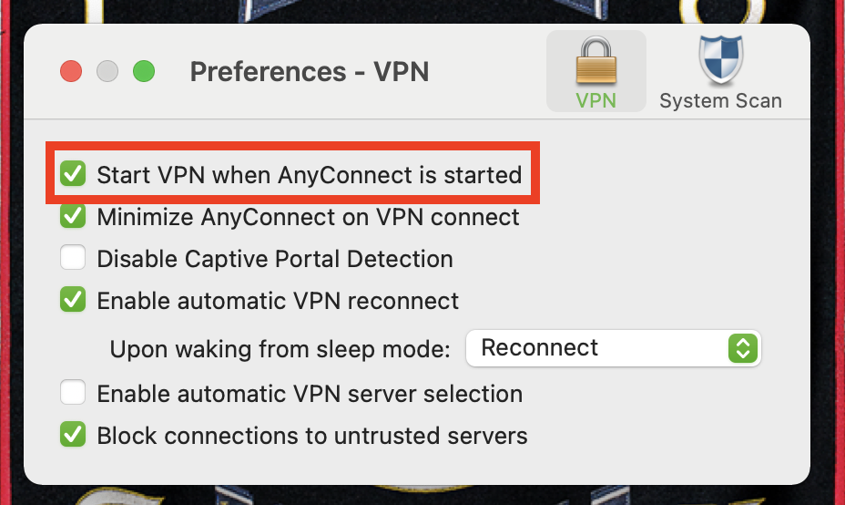
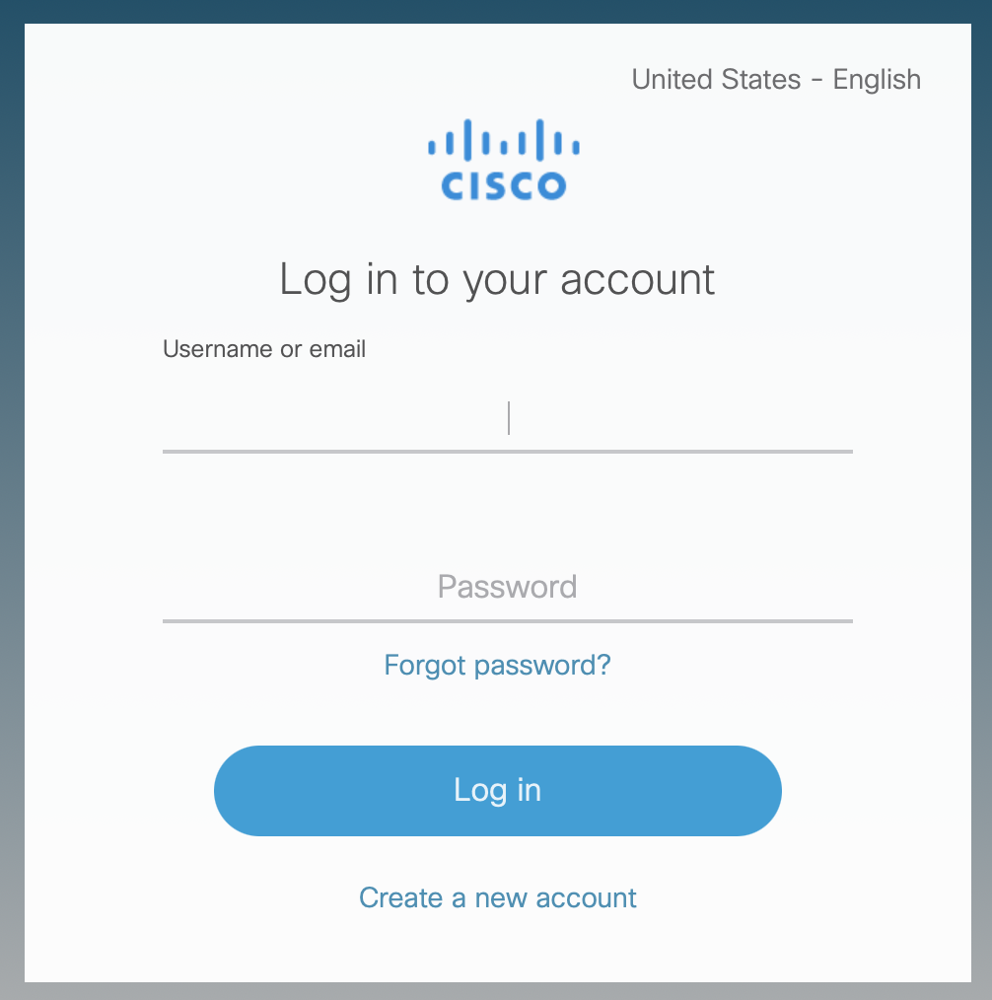
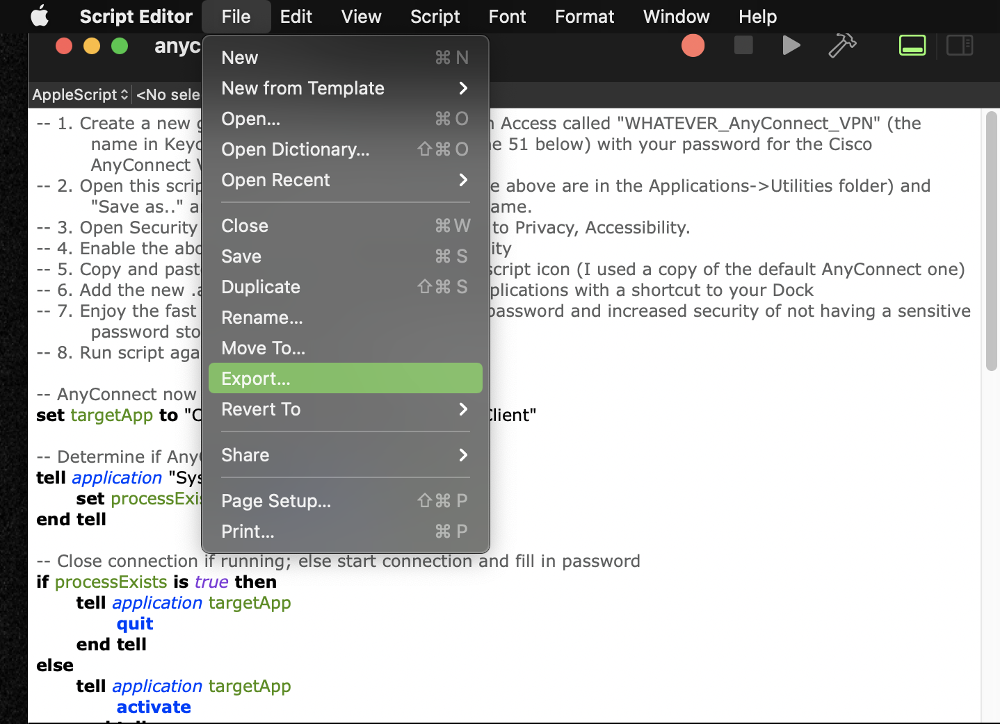
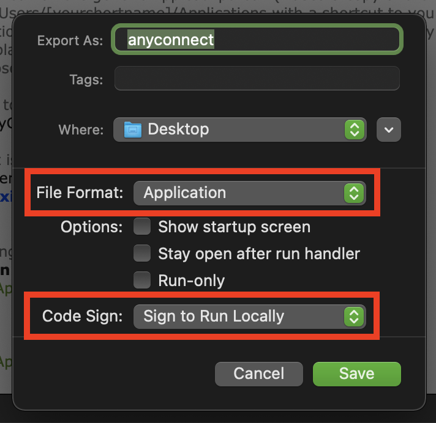
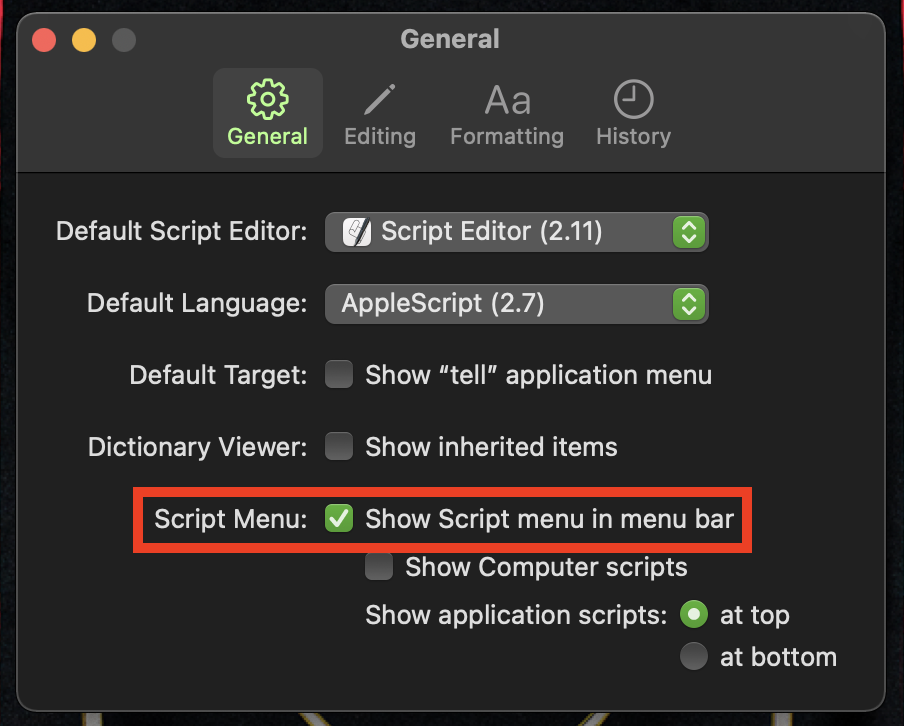
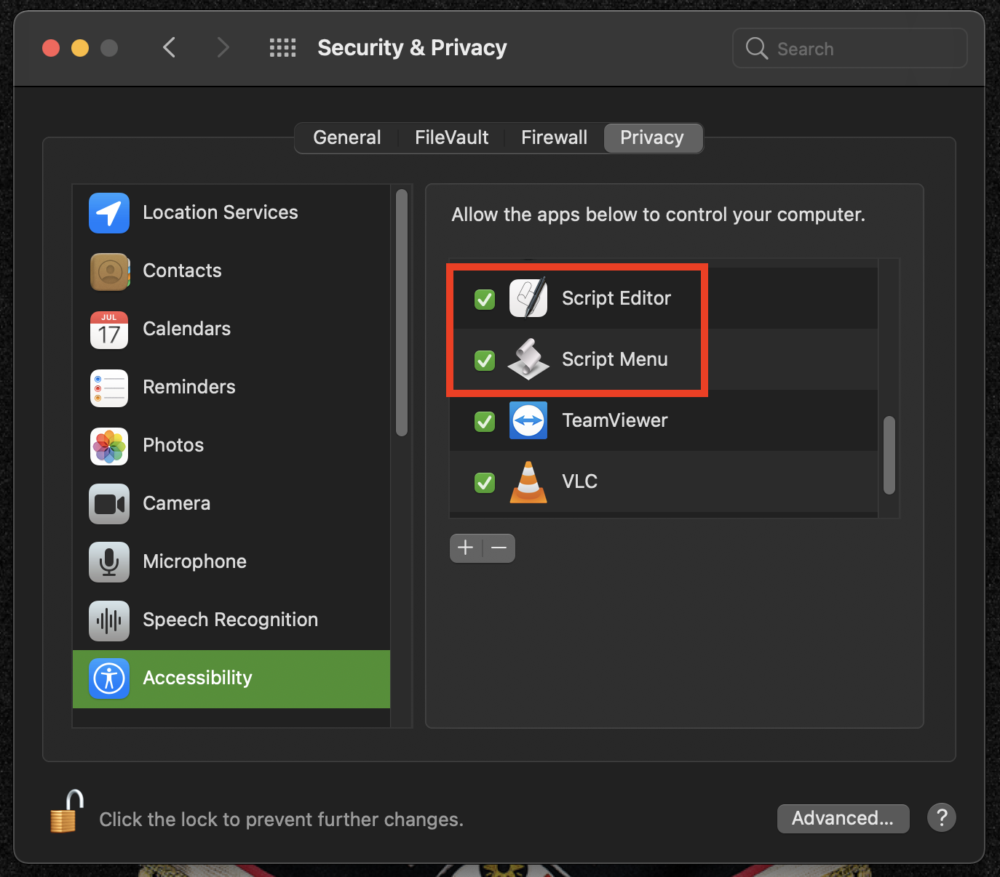
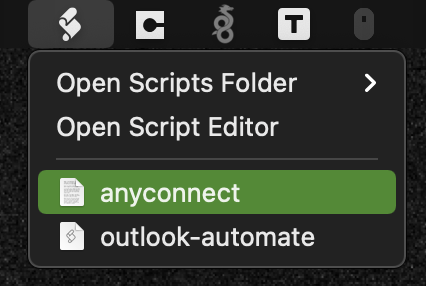

# Autoconnect Cisco AnyConnect VPN on macOS

This automation script is built on top of these concepts. The repository contains the source code of the script that will automate the connection and authentication process of Cisco AnyConnect VPN with Duo.

The script automatically fetches, securely from the KeyChain, the correct credentials and setup the VPN connection. If Duo is used as MFA, a notification will be sent to your device. Once you confirm the notification the connection will be completed and up and running.

**These are the requirements necessary:**

- macOS version 10.7 or higher
- Cisco AnyConnect must have _Start VPN when AnyConnect is started_ enabled (see below)

- Users are presented with the following login prompt after selecting the VPN connection



## How to use it?

You have two options:
- Turn it into an application
- Keep it as a script

**Let's start with the first option: _TURN IT INTO AN APPLICATION_**

1. Open the script source code file ```anyconnect.scpt``` with Script Editor (which is the default program used).

2. On the top menu, select ```File```, then ```Export...``` 


3. In the pop-up window, make sure to select ```Application``` for ```File Format:```, and ```Sign to Run Locally``` for ```Code Sign:```


**Once you have your application compiled and ready:**

1. Open ```Security & Privacy System Preferences```, go to ```Privacy```, then ```Accessibility```.

2. Enable the application you just created to access Accessibility

3. (BONUS) Add the application to ```/Users/[yourhostname]/Applications``` and then to the Dock 

4. Run the application again to close the connection

**Now for the second option: _KEEP IT AS A SCRIPT_**

1. Open the script source code file ```anyconnect.scpt``` with Script Editor (which is the default program used).

2. On the top menu, select ```Script Editor```, then click ```Preferences```

3. In the pop-up window, make sure to select ```Show Script menu in menu bar``` for ```Script Menu:```


4. Save the script in your user's Scripts folder (```/Users/[yourhostname]/Library/Scripts```)

**Once you have saved the script inside your user's script folder:**

1. Open ```Security & Privacy System Preferences```, go to ```Privacy```, then ```Accessibility```.

2. Enable ```Script Menu```

3. (OPTIONAL) Enable ```Script Editor```. This is required if you want to run the script from the Script Editor.


4. Select the scroll looking icon in the top menu and click on the script you saved.

